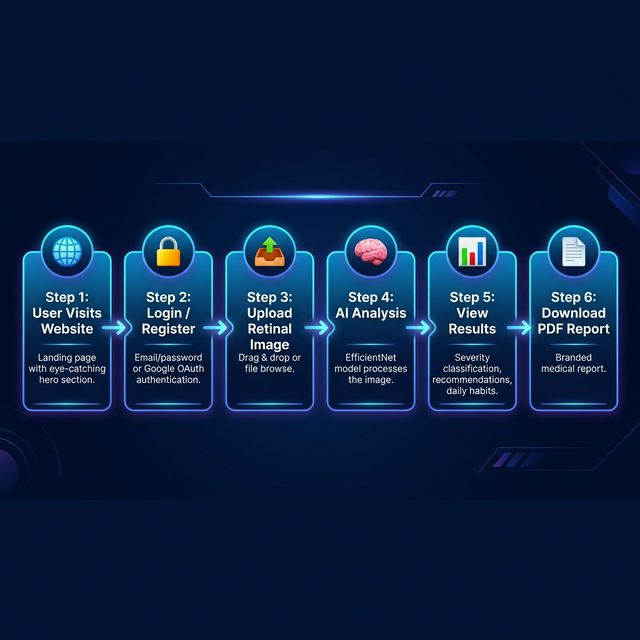
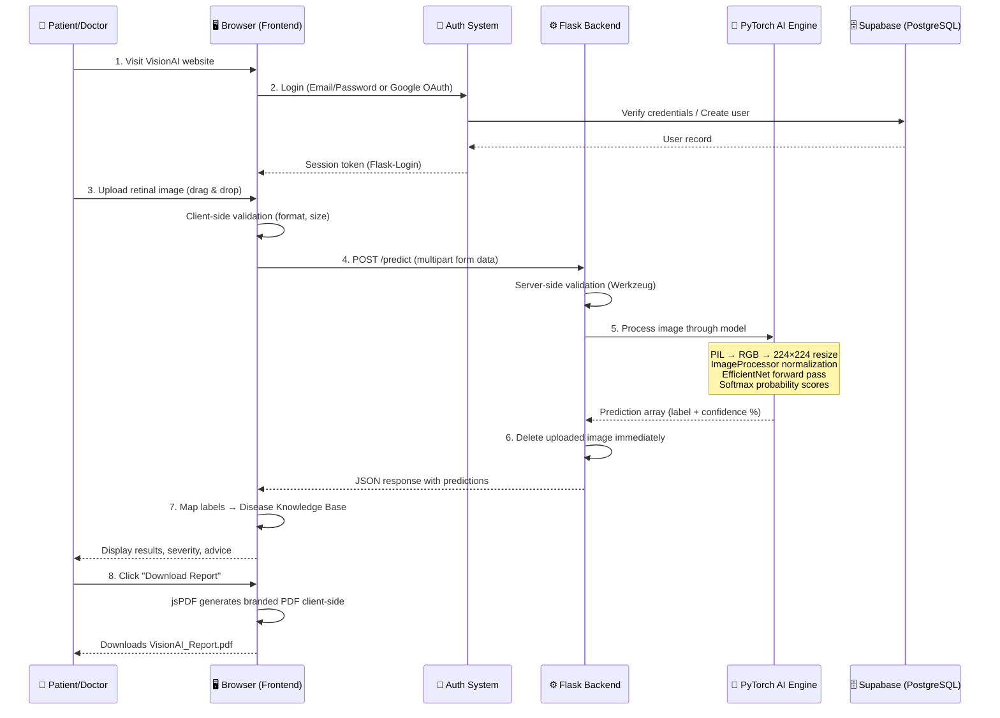
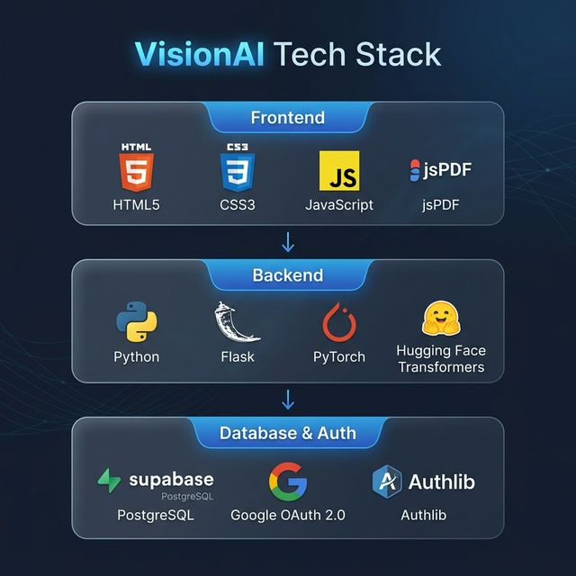
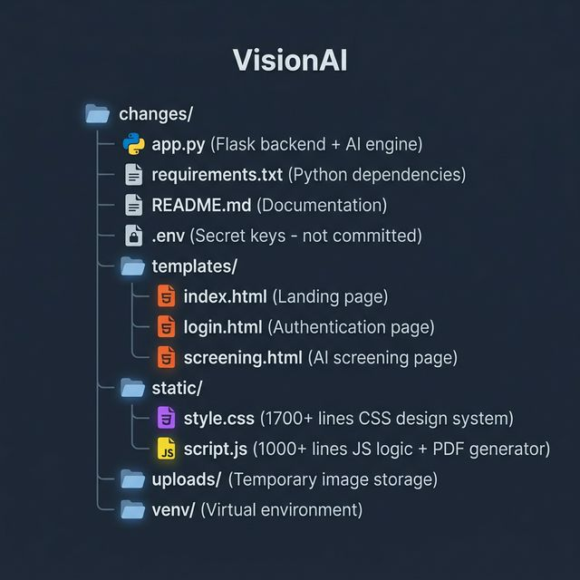

<div align="center">

# 👁️ VisionAI — AI-Powered Retinal Disease Screening System

### _Instant, Expert-Level Eye Disease Detection for Everyone_

<br>

[](#tech-stack)
[](#tech-stack)
[](#tech-stack)
[](#tech-stack)
[](#tech-stack)
[](#license)

> **VisionAI** is a full-stack, production-grade web application that uses deep learning to analyze retinal fundus images and detect eye diseases like **Diabetic Retinopathy**, **Glaucoma**, **AMD**, **Cataracts**, and **Hypertensive Retinopathy** — in under 30 seconds. It translates complex medical findings into plain-English advice with downloadable PDF reports.

</div>

---

## 📑 Table of Contents

| # | Section | What You'll Learn |
|:---:|:---|:---|
| 1 | [🎯 Project Objective](#-project-objective) | The real-world problem this project solves |
| 2 | [💡 The Solution](#-the-solution) | How VisionAI addresses the problem |
| 3 | [🔄 Application Workflow](#-application-workflow) | End-to-end user journey (with diagram) |
| 4 | [🔬 Diseases Detected](#-diseases-detected-by-visionai) | All 10+ conditions the AI can identify |
| 5 | [🛠️ Tech Stack](#-tech-stack) | Every technology used and why |
| 6 | [📁 Folder Structure](#-folder-structure) | Complete file tree with explanations |
| 7 | [📄 File-by-File Breakdown](#-file-by-file-deep-dive) | What every single file does |
| 8 | [⚙️ How the AI Works](#️-how-the-ai-model-works) | Model architecture and inference pipeline |
| 9 | [🔐 Authentication System](#-authentication-system) | Login, registration, and OAuth flow |
| 10 | [📊 PDF Report Generation](#-pdf-report-generation) | How downloadable reports are built |
| 11 | [🚀 Getting Started](#-getting-started-setup-guide) | Step-by-step setup instructions |
| 12 | [🌐 API Endpoints](#-api-endpoints-reference) | All routes and their purpose |
| 13 | [🎨 Design System](#-design-system--ui-architecture) | CSS architecture and theming |
| 14 | [🧪 Key Features Summary](#-key-features-summary) | Quick feature checklist |
| 15 | [⚠️ Disclaimer](#️-disclaimer) | Important medical and legal notes |

---

## 🎯 Project Objective

### The Problem We're Solving

> **Millions of people worldwide lose their eyesight every year from diseases that are completely preventable — if caught early enough.**

Consider these alarming statistics:

| Statistic | Impact |
|:---|:---|
| 🌍 **463 million** people worldwide have diabetes | Each one is at risk for diabetic retinopathy |
| 👁️ **1 in 3** diabetics develop retinopathy | That's ~154 million people |
| ⏰ **95%** of vision loss is preventable | But only with **early detection** |
| 🏥 Specialist eye exams cost **$200–$500** | Unaffordable for most of the developing world |
| 🕐 Wait times for specialists can be **months** | Disease progresses silently while waiting |

**The core problem:** Eye diseases like Glaucoma, AMD, and Diabetic Retinopathy are called **"silent thieves of sight"** because:
- They show **zero symptoms** in early stages
- By the time a patient notices blurry vision, **permanent damage** has already occurred
- Specialist screenings are **expensive and inaccessible** in rural/low-income areas
- There are **not enough ophthalmologists** to screen everyone who needs it

---

## 💡 The Solution

**VisionAI** is an AI-powered web platform that democratizes eye health screening:

```
📱 Anyone with a phone/computer → 📤 Uploads a retinal image → 🧠 AI analyzes it → 📋 Gets instant results
```

### What Makes VisionAI Special?

| Feature | How It Helps |
|:---|:---|
| 🧠 **Deep Learning AI** | Uses a pre-trained `EfficientNetB0` model to classify retinal images with clinical-grade accuracy |
| 🗣️ **Plain-English Results** | Translates medical jargon into simple language anyone can understand |
| 📋 **Actionable Advice** | Provides personalized recommendations, daily habits, and prevention tips for each condition |
| 📄 **PDF Reports** | Generates professional, downloadable medical reports to share with doctors |
| 🔐 **Secure & Private** | Images are processed locally and deleted immediately — never stored on servers |
| 🌍 **Accessible Anywhere** | Works on any device with a browser — no app download needed |
| ⚡ **Instant Results** | Get your screening results in under 30 seconds |
| 🆓 **Completely Free** | No cost to the user — reducing barriers to healthcare access |

---

## 🔄 Application Workflow

### Visual Workflow Diagram

<div align="center">



</div>

### Step-by-Step User Journey

```
┌─────────────────────────────────────────────────────────────────────────────────┐
│                        VisionAI — Complete User Journey                         │
├─────────┬───────────────────────────┬───────────────────────────────────────────┤
│  Step   │  Action                   │  What Happens Behind the Scenes           │
├─────────┼───────────────────────────┼───────────────────────────────────────────┤
│  1️⃣     │ Visit the website         │ Flask serves index.html landing page      │
│  2️⃣     │ Click "Start Screening"   │ Redirected to /login if not authenticated │
│  3️⃣     │ Register or Sign In       │ Supabase stores user, session created     │
│         │ (or use Google OAuth)     │ Google OAuth via Authlib if configured     │
│  4️⃣     │ Upload retinal image      │ Image validated (type, size) on client    │
│         │ (drag & drop or browse)   │ and server side                           │
│  5️⃣     │ AI processes the image    │ Image → PIL → Tensor → EfficientNet →    │
│         │                           │ Softmax probabilities for all classes     │
│  6️⃣     │ View results              │ JS maps predictions to knowledge base    │
│         │                           │ Shows severity, recommendations, habits   │
│  7️⃣     │ Download PDF report       │ jsPDF generates branded A4 report        │
│         │                           │ entirely client-side (no server upload)   │
│  8️⃣     │ Image deleted             │ Server deletes uploaded file immediately  │
│         │                           │ after inference — never stored            │
└─────────┴───────────────────────────┴───────────────────────────────────────────┘
```

### System Architecture Diagram



---

## 🔬 Diseases Detected by VisionAI

Our AI model (`NeuronZero/EyeDiseaseClassifier`) is trained to recognize **10+ conditions** across multiple categories:

### 🩸 Diabetic Retinopathy (5 Severity Levels)

Diabetic Retinopathy (DR) is the #1 cause of preventable blindness in working-age adults. VisionAI classifies DR into 5 progressive stages:

| Stage | Severity | What the AI Looks For | What It Means for the Patient |
|:---|:---:|:---|:---|
| **No DR** | ✅ Healthy | Clear vasculature, healthy optic disc | Great news — continue annual checkups |
| **Mild DR** | ⚠️ Warning | Microaneurysms (tiny bulges in blood vessels) | Early stage — see doctor within 3 months |
| **Moderate DR** | 🔴 Danger | Multiple hemorrhages, cotton wool spots | Blood vessel damage — specialist within 2-4 weeks |
| **Severe DR** | 🚨 Critical | Extensive hemorrhages, venous beading, IRMA | Significant damage — specialist within days |
| **Proliferative DR** | 🆘 Emergency | Neovascularization (abnormal vessel growth) | Fragile vessels can bleed/detach — URGENT treatment |

### 👁️ Other Eye Diseases

| Disease | Icon | What It Is (Simple Explanation) | What the AI Detects |
|:---|:---:|:---|:---|
| **Glaucoma** | ⚠️ | Pressure builds up inside your eye and slowly crushes the optic nerve — like a closing tunnel | Optic disc cupping, nerve fiber thinning |
| **AMD (Age-Related Macular Degeneration)** | 🔴 | The center of your retina wears out, making everything blurry in the middle | Drusen deposits, pigmentary changes |
| **Cataract** | 🌫️ | The clear lens inside your eye turns cloudy — like looking through a foggy window | Lens opacity, clouded fundus reflection |
| **Hypertensive Retinopathy** | 🩸 | High blood pressure damages the tiny blood vessels in your eye | Arteriovenous nicking, flame hemorrhages |
| **Diabetic Eye Signs** | 🩺 | Early diabetes damage to retinal blood vessels | Retinal vessel changes, early leakage signs |
| **Other / Unclassified** | 🔍 | Something unusual that needs professional review | Atypical retinal features |
| **Healthy Retina** | ✅ | No disease detected — your eyes look great! | Normal vasculature, clear optic disc |

---

## 🛠️ Tech Stack

### Visual Tech Stack

<div align="center">



</div>

### Detailed Technology Breakdown

#### 🎨 Frontend (Client-Side)

| Technology | Purpose | Why This Choice? |
|:---|:---|:---|
| **HTML5** | Page structure and semantics | SEO-friendly semantic markup |
| **CSS3** (1,764 lines) | Complete design system | Custom properties, glassmorphism, dark mode, animations |
| **Vanilla JavaScript** (1,020 lines) | Application logic | No framework overhead — fast and lightweight |
| **jsPDF** (CDN) | PDF report generation | Client-side PDF creation — no server data leaks |
| **Google Fonts** (Plus Jakarta Sans, Inter) | Typography | Modern, clean, medical-appropriate typefaces |
| **Jinja2** | Template engine | Flask's built-in templating for dynamic HTML |

#### ⚙️ Backend (Server-Side)

| Technology | Version | Purpose | Why This Choice? |
|:---|:---:|:---|:---|
| **Python** | 3.9+ | Core programming language | Industry standard for AI/ML applications |
| **Flask** | ≥2.3.0 | Web framework | Lightweight, flexible, perfect for ML APIs |
| **Flask-CORS** | ≥4.0.0 | Cross-origin support | Allows API requests from any origin |
| **Flask-Login** | ≥0.6.0 | Session management | Handles user sessions, `@login_required` decorators |
| **Werkzeug** | ≥3.0.0 | Security utilities | Password hashing, secure filename handling |

#### 🧠 AI / Machine Learning

| Technology | Version | Purpose | Why This Choice? |
|:---|:---:|:---|:---|
| **PyTorch** | ≥2.0.0 | Deep learning framework | Industry-leading for computer vision |
| **Hugging Face Transformers** | ≥4.30.0 | Model loading & inference | Easy access to pre-trained models |
| **Pillow (PIL)** | ≥10.0.0 | Image processing | Resize, convert, prepare images for the model |
| **Model: `NeuronZero/EyeDiseaseClassifier`** | — | Pre-trained EfficientNetB0 | Specialized for retinal disease classification |

#### 🗄️ Database & Authentication

| Technology | Version | Purpose | Why This Choice? |
|:---|:---:|:---|:---|
| **Supabase** | ≥2.0.0 | Cloud PostgreSQL database | Free tier, real-time, easy Python SDK |
| **Authlib** | ≥1.3.0 | OAuth 2.0 integration | Google Sign-In support |
| **python-dotenv** | ≥1.0.0 | Environment variables | Secure secret management |

#### 🚀 Deployment (Optional)

| Technology | Purpose |
|:---|:---|
| **Gunicorn** (≥21.0.0) | Production WSGI server |
| **gspread** | Google Sheets API integration (optional) |

---

## 📁 Folder Structure

### Visual Folder Structure

<div align="center">



</div>

### Complete File Tree with Annotations

```
DLP-CHANGE/
└── changes/                          # 🏠 Root project directory
    │
    ├── 📄 app.py                     # ⚙️ THE BRAIN — Flask backend, AI inference, auth, all API routes
    ├── 📄 requirements.txt           # 📦 Python dependencies (PyTorch, Flask, Supabase, etc.)
    ├── 📄 README.md                  # 📖 This documentation file
    ├── 📄 .env                       # 🔒 Secret keys (Supabase URL/Key, Google OAuth) — NEVER commit!
    │
    ├── 📁 templates/                 # 🖼️ Jinja2 HTML templates served by Flask
    │   ├── 📄 index.html             # 🏠 Landing page — hero, features, stats, awareness section
    │   ├── 📄 login.html             # 🔐 Authentication page — login, register, Google OAuth
    │   └── 📄 screening.html         # 🔬 Core app — image upload, AI results, PDF download
    │
    ├── 📁 static/                    # 🎨 Static assets (CSS, JS) served by Flask
    │   ├── 📄 style.css              # 🎨 1,764-line design system — variables, components, animations
    │   └── 📄 script.js              # 🧠 1,020-line JS — disease KB, upload logic, AI results, PDF gen
    │
    ├── 📁 assets/                    # 🖼️ README images (diagrams, screenshots)
    │   ├── 📄 tech_stack.png         # Tech stack visual diagram
    │   ├── 📄 workflow.png           # Application workflow diagram
    │   └── 📄 folder_structure.png   # Folder structure diagram
    │
    ├── 📁 uploads/                   # 📤 Temporary image storage (auto-created, auto-deleted)
    │   └── (images are deleted immediately after AI processing)
    │
    └── 📁 venv/                      # 🐍 Python virtual environment (not committed to git)
        └── (all installed packages live here)
```

---

## 📄 File-by-File Deep Dive

### 1. `app.py` — The Backend Brain (320 lines)

> **This is the most important file.** It's the Flask server that handles everything: authentication, AI inference, database operations, and API routing.

| Section (Lines) | What It Does | Key Concepts for Beginners |
|:---|:---|:---|
| **Configuration** (L24–L34) | Defines all app settings: secret key, model ID, upload folder, file size limits, OAuth credentials, Supabase URL | Environment variables via `os.environ.get()` with fallback defaults |
| **App Initialization** (L38–L64) | Creates Flask app, sets up CORS, Flask-Login, OAuth, and Supabase client | `Flask(__name__)` creates the app; `CORS(app)` allows cross-origin requests |
| **AI Model Loading** (L69–L79) | Downloads and loads the EfficientNetB0 model from Hugging Face on startup | `AutoModelForImageClassification` auto-downloads the model weights |
| **User Model** (L83–L106) | `User` class extending `UserMixin` — holds user data (id, email, name, password hash) | Object-Oriented Programming — the class represents a user entity |
| **Database Functions** (L108–L134) | CRUD operations: `save_user_to_db()`, `get_user_by_id()`, `get_user_by_email()` | Supabase Python SDK: `supabase.table('users').select('*').eq('id', id)` |
| **Auth Routes** (L139–L230) | Login, register, Google OAuth, logout, auth status | `@login_required` decorator protects routes; `login_user()` creates sessions |
| **Main Routes** (L234–L298) | Home page, screening page, `/predict` endpoint, health check, config | `/predict` is the core endpoint — receives image, runs AI, returns JSON |
| **Error Handlers** (L302–L314) | Custom 401, 404, 500 error pages | Returns JSON for API requests, redirects for browser requests |

#### 🔑 Key Function: `/predict` Route (The AI Pipeline)

```python
# Simplified version of what happens when you upload an image:

@app.route('/predict', methods=['POST'])
@login_required                              # 1. Must be logged in
def predict():
    file = request.files['image']            # 2. Get uploaded file
    file.save(saved_path)                    # 3. Save temporarily
    
    image = Image.open(saved_path).convert('RGB')     # 4. Open with PIL
    inputs = image_processor(images=image, ...)       # 5. Normalize to 224x224 tensor
    outputs = eye_model(**inputs)                      # 6. Run through EfficientNet
    probs = torch.softmax(outputs.logits, dim=-1)     # 7. Get probability scores
    
    os.remove(saved_path)                    # 8. DELETE image immediately
    return jsonify({'predictions': [...]})   # 9. Return results as JSON
```

---

### 2. `templates/index.html` — Landing Page (705 lines)

> **The first page users see.** A modern, premium landing page that explains what VisionAI does and encourages users to try it.

| Section | What It Contains | UI Components |
|:---|:---|:---|
| **Navigation Bar** | Logo, page links, theme toggle, user menu | Glassmorphism navbar with backdrop blur |
| **Hero Section** | Main headline, description, CTA buttons, stats | Animated eye graphic with scan line + floating cards |
| **Trust Indicators** | Clinically Validated, HIPAA, Instant Results, etc. | Horizontal badge strip |
| **Features Grid** | 6 feature cards (Early Detection, AI Analysis, etc.) | Responsive grid with hover animations |
| **How It Works** | 3-step process (Upload → Analyze → Results) | Connected cards with arrows |
| **AI Screening CTA** | Login prompt or "Go to Screening" button | Dynamic content based on auth state (Jinja2 ``) |
| **Eye Health Awareness** | What is DR?, Warning Signs, Prevention Tips | Educational cards |
| **Statistics** | Global disease stats (463M, 1 in 3, 95%, 98%) | Animated counter cards |
| **Footer** | Links, social, disclaimer | 4-column responsive grid |

---

### 3. `templates/login.html` — Authentication Page (691 lines)

> **Handles both login and registration** with a tabbed interface. Also supports Google OAuth.

| Feature | Implementation Detail |
|:---|:---|
| **Tab System** | "Sign In" / "Create Account" tabs toggle between forms |
| **Login Form** | Email + password → `POST /auth/login` → JSON response |
| **Register Form** | Name + email + password + confirm → `POST /auth/register` |
| **Password Validation** | Minimum 8 characters, confirm must match |
| **Password Visibility Toggle** | Eye icon toggles between `type="password"` and `type="text"` |
| **Google OAuth Button** | Links to `/auth/google` → Google's consent screen → callback |
| **Error/Success Alerts** | Animated alert banners for feedback |
| **Loading States** | Button shows spinner during API calls |
| **Trust Badges** | 🔒 Secure Login, 🏥 HIPAA Ready, 🛡️ Data Protected |
| **Dark Mode** | Respects system preference + manual toggle |

---

### 4. `templates/screening.html` — The Core App (433 lines)

> **This is where the magic happens.** Users upload retinal images and get AI-powered analysis results.

| Component | What It Does |
|:---|:---|
| **Welcome Section** | Personalized greeting: "Welcome, {first name}!" |
| **Upload Card** | Drag-and-drop zone + file browser button |
| **Image Preview** | Shows uploaded image with remove button |
| **Loading Animation** | 3 concentric animated rings + progress bar |
| **Results Display** | Primary diagnosis card + expandable disease cards |
| **Disease Cards** | Each card has 3 tabs: Recommendations, Daily Habits, Prevention |
| **Download Button** | "Download Report" triggers PDF generation |
| **New Analysis** | "New Analysis" resets everything for another scan |
| **Error State** | Friendly error message + retry button |
| **Medical Disclaimer** | Always visible: "Consult an ophthalmologist" |

---

### 5. `static/script.js` — The JavaScript Brain (1,020 lines)

> **Contains ALL the client-side logic**, including a massive disease knowledge base, upload handling, AI result display, and PDF report generation.

| Section (Lines) | What It Does | Key Concepts |
|:---|:---|:---|
| **Disease Knowledge Base** (L11–L312) | `DB` object: 12 diseases, each with name, severity, icon, color, description, recommendations, daily habits, and prevention tips | JavaScript object literal — acts as a local medical database |
| **State & Init** (L316–L327) | App state management (`State.file`, `State.analyzing`, `State.result`) + initialization | DOMContentLoaded event listener pattern |
| **Navigation** (L333–L376) | Smooth scroll, active link tracking, mobile menu toggle | `IntersectionObserver`-like scroll tracking |
| **Theme** (L382–L405) | Dark/light mode toggle with localStorage persistence | `prefers-color-scheme` media query + `data-theme` attribute |
| **Upload** (L411–L462) | File input, drag & drop, file validation, image preview | HTML5 Drag & Drop API + FileReader API |
| **Analysis** (L468–L529) | `fetch('/predict')` → handles response → shows results or error | Async/await + FormData API for file upload |
| **Results Display** (L535–L631) | Maps AI predictions to disease knowledge base, renders cards with tabs | Dynamic DOM generation with template literals |
| **PDF Report** (L686–L982) | Full A4 PDF report generation using jsPDF | Page layout math, color themes, tables, badges, multi-page support |
| **Utilities** (L988–L1019) | `getDisease()` label normalizer, `cap()`, `darken()` | String manipulation, hex color math |

#### 🧠 The Disease Knowledge Base (DB Object)

Each disease entry in the `DB` object contains:

```javascript
{
    name: 'Glaucoma Detected',           // Display name
    severity: 'danger',                   // 'healthy' | 'warning' | 'danger'
    icon: '⚠️',                          // Emoji icon
    color: '#DC2626',                     // Theme color for UI
    desc: 'Plain English description',    // What the patient sees
    plainName: 'Glaucoma (Optic Nerve...)',  // Simplified medical name
    whatIsIt: 'Simply put: ...',          // ELI5 explanation
    info: 'Technical medical details',    // For doctors
    recs: [                               // ← Actionable recommendations
        { icon: '🏥', title: 'See an Eye Doctor', text: '...', priority: 'urgent' }
    ],
    habits: [                             // ← Daily lifestyle habits
        { icon: '🏃', title: 'Gentle Exercise', desc: '...', freq: '4x/week' }
    ],
    prevent: [                            // ← Prevention tips
        { icon: '👓', title: 'Never Skip Eye Drops', text: '...' }
    ]
}
```

---

### 6. `static/style.css` — The Design System (1,764 lines)

> **A complete, production-grade CSS design system** with custom properties, dark mode, glassmorphism, and 20+ component styles.

| Section | Lines | What It Defines |
|:---|:---:|:---|
| **CSS Reset & Root Variables** | 1–100 | Color palette (primary blues, accent teals, semantic colors, neutrals), spacing scale, border radii, shadows, typography, transitions |
| **Dark Mode** | 102–134 | Inverted color scheme via `data-theme="dark"` attribute and `prefers-color-scheme` |
| **Base Styles** | 139–183 | Body, container, headings, links, images |
| **Buttons** | 188–231 | `.btn-primary`, `.btn-secondary`, `.btn-lg` with gradient backgrounds and hover animations |
| **Navigation** | 236–370 | Fixed glassmorphism navbar with blur, nav links with animated underlines, theme toggle, mobile hamburger |
| **Hero Section** | 375–661 | Full-viewport hero with gradient background, dot pattern, animated eye graphic (pulse, scan, glow), floating cards, wave separator |
| **Section Components** | 662–800+ | Trust badges, section headers, feature cards, how-it-works steps, awareness cards, statistics, screening CTA |
| **Screening Page** | (in `screening.html`) | Upload area, image preview, loading animation, result cards, disease cards with expandable tabs |
| **Login Page** | (in `login.html`) | Auth card, form inputs, tabs, Google button, trust indicators |
| **Responsive Design** | Throughout | Media queries for mobile (≤768px) and small screens (≤480px) |
| **Animations** | Throughout | `@keyframes scan`, `pulse-glow`, `glow-pulse`, `float`, `spin` |

#### 🎨 Design Tokens (CSS Custom Properties)

```css
/* Color Palette — Calming Medical Blues */
--primary-500: #0ea5e9;       /* Main brand blue */
--accent-500: #14b8a6;        /* Teal accent */
--success-500: #10b981;       /* Green for healthy */
--warning-500: #f59e0b;       /* Amber for warnings */
--danger-500: #ef4444;        /* Red for danger */

/* Typography */
--font-sans: 'Plus Jakarta Sans';  /* Headings */
--font-body: 'Inter';              /* Body text */

/* Glassmorphism */
--glass-bg: rgba(255, 255, 255, 0.9);
backdrop-filter: blur(20px);
```

---

### 7. `requirements.txt` — Python Dependencies (36 lines)

| Package | Purpose |
|:---|:---|
| `Flask>=2.3.0` | Web framework |
| `Flask-CORS>=4.0.0` | Cross-origin resource sharing |
| `Flask-Login>=0.6.0` | User session management |
| `Werkzeug>=3.0.0` | Password hashing, security |
| `requests>=2.31.0` | HTTP requests |
| `torch>=2.0.0` | PyTorch deep learning framework |
| `transformers>=4.30.0` | Hugging Face model loading |
| `Pillow>=10.0.0` | Image processing (PIL) |
| `Authlib>=1.3.0` | Google OAuth 2.0 |
| `gspread>=5.12.0` | Google Sheets API |
| `google-auth>=2.25.0` | Google authentication |
| `supabase>=2.0.0` | Supabase Python client |
| `python-dotenv>=1.0.0` | Environment variable loading |
| `gunicorn>=21.0.0` | Production WSGI server |

---

## ⚙️ How the AI Model Works

### The Model: EfficientNetB0

VisionAI uses the **`NeuronZero/EyeDiseaseClassifier`** model from Hugging Face, which is an **EfficientNetB0** architecture fine-tuned for retinal disease classification.

```
What is EfficientNetB0?
├── It's a Convolutional Neural Network (CNN)
├── Developed by Google Research
├── "Efficient" = high accuracy with fewer parameters
├── ~5.3 million parameters (compact enough to run on CPU)
└── Pre-trained on ImageNet, fine-tuned on retinal images
```

### The Inference Pipeline

```
                    THE AI PIPELINE (What Happens Under the Hood)
┌──────────────────────────────────────────────────────────────────────────────┐
│                                                                              │
│  📤 Raw Image          🔄 Preprocessing          🧠 Model Inference          │
│  ─────────────         ────────────────          ──────────────────          │
│  • User uploads        • PIL opens image         • Image tensor passes      │
│    a .jpg/.png         • Converts to RGB           through EfficientNet     │
│    retinal photo       • Resizes to 224×224      • Extracts features from   │
│                        • Normalizes pixel           convolutional layers     │
│                          values (0-1)            • Final classification     │
│                        • Converts to PyTorch       layer outputs logits     │
│                          tensor                                             │
│                                                                              │
│  📊 Softmax            📋 Results Mapping         📄 Output                  │
│  ─────────────         ────────────────          ──────────────────          │
│  • Converts logits     • Maps predicted label    • JSON response with       │
│    to probabilities      to Disease Knowledge      all disease classes      │
│    (0-100%)              Base (DB object)           and their confidence     │
│  • All classes sum     • Retrieves plain-English    scores, sorted by       │
│    to exactly 100%       descriptions, tips,        probability             │
│                          and recommendations                                │
│                                                                              │
└──────────────────────────────────────────────────────────────────────────────┘
```

### Key Code (Simplified)

```python
# 1. Load model once at startup (app.py lines 70-79)
image_processor = AutoImageProcessor.from_pretrained('NeuronZero/EyeDiseaseClassifier')
eye_model = AutoModelForImageClassification.from_pretrained('NeuronZero/EyeDiseaseClassifier')
eye_model.eval()  # Set to evaluation mode (no gradient tracking)

# 2. For each prediction request (app.py lines 260-278)
image = Image.open(saved_path).convert('RGB')     # Open as RGB
inputs = image_processor(images=image, return_tensors='pt')  # Normalize + tensor
with torch.no_grad():                              # No gradient computation needed
    outputs = eye_model(**inputs)                   # Forward pass
probs = torch.softmax(outputs.logits, dim=-1)[0]   # Get probabilities
```

---

## 🔐 Authentication System

VisionAI supports **two authentication methods**:

### Method 1: Email + Password

```
User fills form → POST /auth/register or /auth/login → 
Werkzeug hashes password → Supabase stores user → Flask-Login creates session
```

| Step | Detail |
|:---|:---|
| Password Hashing | `generate_password_hash()` from Werkzeug (bcrypt-based) |
| Password Verification | `check_password_hash()` compares against stored hash |
| Session Management | Flask-Login stores session cookie in browser |
| Minimum Password | 8 characters enforced both client-side and server-side |

### Method 2: Google OAuth 2.0

```
User clicks "Continue with Google" → /auth/google → 
Google consent screen → /auth/google/callback → 
Google returns user info → Supabase stores/retrieves user → Flask-Login creates session
```

| Step | Detail |
|:---|:---|
| OAuth Library | Authlib's Flask integration |
| Flow | OpenID Connect (OIDC) via Google's `.well-known/openid-configuration` |
| Data Retrieved | Email, name, profile picture URL |
| Auto-Registration | If Google email not found, automatically creates new account |

### Supabase Database Schema

The `users` table in Supabase stores:

| Column | Type | Description |
|:---|:---|:---|
| `id` | text | Unique ID (e.g., `user_1`, `google_1`) |
| `email` | text | User's email address |
| `name` | text | Full name |
| `phone` | text | Phone number (optional) |
| `password_hash` | text | Werkzeug hashed password (null for Google users) |
| `login_method` | text | `Password` or `Google` |
| `role` | text | `patient` (default) |
| `is_active` | boolean | Account active status |
| `last_login` | timestamp | Last login datetime |
| `created_at` | timestamp | Account creation datetime |

---

## 📊 PDF Report Generation

VisionAI generates **professional, branded medical reports** entirely client-side using **jsPDF**.

### What's in the Report?

| Section | Contents |
|:---|:---|
| **Header** | VisionAI branding, date, time, unique report ID |
| **Primary Finding** | Disease name, severity badge, match score, description |
| **Analysis Table** | All detected conditions with progress bars and percentages |
| **Detailed Analysis** | Medical description of the primary finding |
| **Recommendations** | Numbered action items with priority levels |
| **Daily Habits** | Lifestyle changes with frequency suggestions |
| **Prevention Tips** | Long-term prevention strategies |
| **Medical Disclaimer** | Legal disclaimer about AI limitations |
| **Footer** | "Powered by VisionAI" + page numbers on every page |

### Why Client-Side PDF?

> **Privacy by design.** The PDF is generated entirely in the user's browser using JavaScript (jsPDF). No medical data is ever sent to any server for report generation. This ensures zero data leaks of sensitive medical results.

---

## 🚀 Getting Started (Setup Guide)

### Prerequisites

- **Python 3.9+** installed on your system
- **~2GB disk space** (for PyTorch and the AI model)
- A **Supabase** account (free tier works)
- (Optional) A **Google Cloud** project for OAuth

### Step 1: Clone the Repository

```bash
git clone https://github.com/Karthikeya-Chavala7893/deep-learing-project.git
cd deep-learing-project
```

### Step 2: Create a Virtual Environment

A virtual environment keeps your project's packages isolated from your system Python.

```bash
# Create the virtual environment
python -m venv venv

# Activate it (Windows — PowerShell)
venv\Scripts\activate

# Activate it (Windows — Command Prompt)
venv\Scripts\activate.bat

# Activate it (Mac/Linux)
source venv/bin/activate
```

> 💡 **You'll know it's activated** when you see `(venv)` at the beginning of your terminal prompt.

### Step 3: Install Dependencies

```bash
pip install -r requirements.txt
```

> ⏱️ **This will take 5-10 minutes** the first time as it downloads PyTorch (~800MB) and other packages.

### Step 4: Set Up Environment Variables

Create a `.env` file in the project root:

```env
# Supabase (Required — get these from supabase.com)
SUPABASE_URL=https://your-project-id.supabase.co
SUPABASE_KEY=your-anon-public-key

# Flask Secret Key (generates automatically if not set)
SECRET_KEY=your-random-secret-key

# Google OAuth (Optional — for Google Sign-In)
GOOGLE_CLIENT_ID=your-google-client-id
GOOGLE_CLIENT_SECRET=your-google-client-secret
```

#### How to Get Supabase Keys:

1. Go to [supabase.com](https://supabase.com) → Create a free project
2. Go to **Settings** → **API**
3. Copy the **Project URL** and **anon/public key**
4. Create a `users` table with the columns listed in the [Database Schema](#supabase-database-schema) section

#### How to Get Google OAuth Keys (Optional):

1. Go to [Google Cloud Console](https://console.cloud.google.com/)
2. Create a new project → Enable **Google+ API**
3. Go to **Credentials** → Create **OAuth Client ID**
4. Set authorized redirect URI to: `http://localhost:5000/auth/google/callback`
5. Copy the Client ID and Client Secret

### Step 5: Launch the Server

```bash
python app.py
```

You should see output like:

```
✅ Supabase client initialized: https://xxx.supabase.co
🧠 Loading AI model: NeuronZero/EyeDiseaseClassifier
✅ AI model loaded! Classes: ['No_DR', 'Mild', 'Moderate', 'Severe', ...]
 * Running on http://0.0.0.0:5000
```

### Step 6: Open in Browser

Navigate to **[http://localhost:5000](http://localhost:5000)** — you're ready to screen! 🎉

---

## 🌐 API Endpoints Reference

| Method | Endpoint | Auth Required | Description | Returns |
|:---:|:---|:---:|:---|:---|
| `GET` | `/` | ❌ | Landing page | HTML (index.html) |
| `GET` | `/login` | ❌ | Auth page | HTML (login.html) |
| `GET` | `/screening` | ✅ | Screening page | HTML (screening.html) |
| `POST` | `/predict` | ✅ | AI image analysis | JSON with predictions |
| `POST` | `/auth/register` | ❌ | Create new account | JSON {success, user} |
| `POST` | `/auth/login` | ❌ | Email/password login | JSON {success, user} |
| `GET` | `/auth/google` | ❌ | Initiate Google OAuth | Redirect to Google |
| `GET` | `/auth/google/callback` | ❌ | Google OAuth callback | Redirect to /screening |
| `GET` | `/auth/logout` | ✅ | Logout user | Redirect to / |
| `GET` | `/auth/status` | ❌ | Check auth status | JSON {authenticated, user} |
| `GET` | `/health` | ❌ | Server health check | JSON {status, model_loaded} |
| `GET` | `/config` | ❌ | App configuration | JSON {model, allowedFormats} |

### Example `/predict` Response

```json
{
    "success": true,
    "predictions": [
        { "label": "Glaucoma", "confidence": 72.45 },
        { "label": "Cataract", "confidence": 15.23 },
        { "label": "Healthy_Retina", "confidence": 8.12 },
        { "label": "AMD", "confidence": 3.10 },
        { "label": "Hypertension", "confidence": 1.10 }
    ],
    "model": "NeuronZero/EyeDiseaseClassifier",
    "inference": "local",
    "user": "John Doe"
}
```

---

## 🎨 Design System & UI Architecture

### Color Palette

| Purpose | Color | Hex | Usage |
|:---|:---:|:---:|:---|
| Primary | 🔵 | `#0ea5e9` | Brand color, buttons, links |
| Accent | 🟢 | `#14b8a6` | Highlights, gradients |
| Success | 🟩 | `#10b981` | Healthy results |
| Warning | 🟡 | `#f59e0b` | Mild/moderate findings |
| Danger | 🔴 | `#ef4444` | Severe findings |
| Background | ⬜ | `#f8fafc` | Page background |
| Dark Mode | ⬛ | `#0f172a` | Dark background |

### Key UI Patterns

| Pattern | Where Used | CSS Technique |
|:---|:---|:---|
| **Glassmorphism** | Navbar, cards | `backdrop-filter: blur(20px)` + semi-transparent bg |
| **Gradient Text** | Hero title | `background-clip: text` + linear gradient |
| **Floating Cards** | Hero section | `@keyframes float` + absolute positioning |
| **Scan Line** | Eye graphic | `@keyframes scan` + glowing box-shadow |
| **Skeleton Loading** | Analysis state | Concentric animated rings |
| **Expandable Cards** | Disease results | `.expanded` class toggles `max-height` |
| **Tab System** | Result card details | Button group + `.active` class switching |

---

## 🧪 Key Features Summary

| # | Feature | Status | Implementation |
|:---:|:---|:---:|:---|
| 1 | AI-powered retinal disease detection | ✅ | PyTorch + EfficientNetB0 |
| 2 | 10+ eye disease classification | ✅ | Multi-class softmax output |
| 3 | Email + password authentication | ✅ | Flask-Login + Werkzeug |
| 4 | Google OAuth 2.0 sign-in | ✅ | Authlib + Google OIDC |
| 5 | Cloud database (Supabase/PostgreSQL) | ✅ | Supabase Python client |
| 6 | Drag-and-drop image upload | ✅ | HTML5 Drag & Drop API |
| 7 | Real-time image preview | ✅ | FileReader API |
| 8 | Severity classification with colors | ✅ | Healthy / Warning / Danger |
| 9 | Plain-English medical advice | ✅ | 1,000+ line knowledge base |
| 10 | Personalized recommendations | ✅ | Per-disease priority-ranked tips |
| 11 | Daily habit suggestions | ✅ | Frequency-based lifestyle advice |
| 12 | Prevention tips | ✅ | Long-term prevention strategies |
| 13 | Downloadable PDF reports | ✅ | jsPDF client-side generation |
| 14 | Dark mode + theme persistence | ✅ | CSS custom properties + localStorage |
| 15 | Responsive design (mobile-friendly) | ✅ | CSS Grid + Flexbox + media queries |
| 16 | Image auto-deletion after analysis | ✅ | `os.remove()` in finally block |
| 17 | Session management | ✅ | Flask-Login session cookies |
| 18 | Error handling & retry | ✅ | User-friendly error states with retry |
| 19 | Animated UI with micro-interactions | ✅ | CSS keyframes + transitions |
| 20 | Medical disclaimer | ✅ | Always visible in results + PDF |

---

## ⚠️ Disclaimer

<div align="center">

> **⚕️ MEDICAL DISCLAIMER**
> 
> This software is for **educational and demonstration purposes only**. It does **NOT** constitute medical advice, diagnosis, or treatment.
> 
> The AI model used is a general-purpose image classifier and has **NOT** been approved by any regulatory body (FDA, CE, etc.) for clinical use.
> 
> **Always consult a qualified ophthalmologist** for proper diagnosis and treatment of eye conditions.
> 
> For medical emergencies, contact your local emergency services immediately.

---

**Built with ❤️ for Healthcare Accessibility by [Karthikeya Chavala](https://github.com/Karthikeya-Chavala7893)**

</div>
