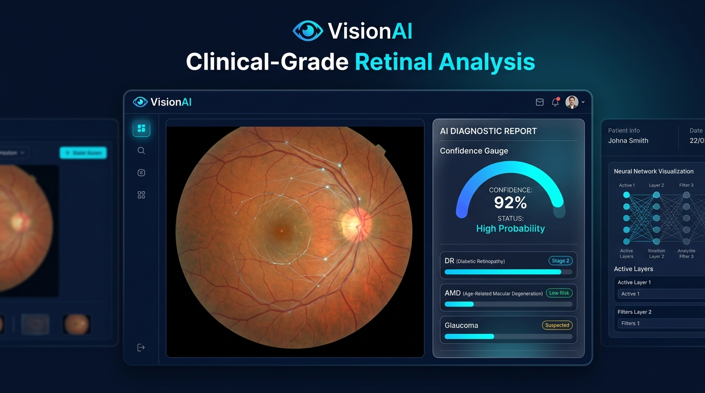

<div align="center">

# 👁️ VisionAI — Dual-Mode Tele-Ophthalmology Platform

### Dual AI-Powered Retinal Screening & Daily Home Eye Check Gateway

[](https://github.com/Karthikeya-Chavala7893)
[](https://huggingface.co/Karthikeya-Chavala7893/retfound-visionai)
[](https://huggingface.co/NeuronZero/EyeDiseaseClassifier)
[](#-9-how-the-ai-models-classify-diseases--image-requirements)
[-Peer--Reviewed-FF6B6B?style=for-the-badge&logo=nature&logoColor=white)](https://doi.org/10.1038/s41586-023-06555-x)
[-10B981?style=for-the-badge&logo=pytest&logoColor=white)](#-15-testing--quality-assurance)
[](https://nextjs.org/)
[](https://flask.palletsprojects.com/)
<br/>



</div>

---

## 📌 1. What is the Project?

**VisionAI** is a full-stack, dual-mode eye health screening platform. It connects everyday home self-screening with specialized hospital eye diagnostics using two dedicated AI models:

1. **🏠 Daily Home Eye Check (Model 2 — `NeuronZero/EyeDiseaseClassifier`)**:
   - **Image Input**: **Normal Eye / Smartphone Camera Images** (external eye photos).
   - **Purpose**: Fast home self-check combining a 25-symptom checklist with BEiT transformer image classification.
2. **🏥 Clinical Retinal Scan (Model 1 — `retfound-visionai`)**:
   - **Image Input**: **Retinal Fundus Camera Images / OCT Scans** (interior back of the eye).
   - **Purpose**: Deep clinical-grade AI diagnosis powered by the **RETFound Vision Transformer (ViT-Large/16)** with **91.62% clinical accuracy**.

---

## 👥 2. Who It Impacts

- **Rural & Low-Income Families**: People living far from specialized eye hospitals who cannot afford frequent clinical visits.
- **463+ Million Diabetic Patients**: Individuals at high risk of Diabetic Retinopathy who require regular retinal checks.
- **Elderly Individuals**: Seniors developing painless cataracts or glaucoma without early visual symptoms.
- **Primary Healthcare Workers**: Rural clinic nurses and volunteers who need a fast tool to triage patients for urgent referral.

---

## 🌍 3. How It Impacts

- **Prevents Avoidable Blindness**: Over **95% of vision loss** from diabetes and glaucoma is preventable if detected early.
- **Correct Image-to-Model Matching**: Users upload **Normal Eye Images** at home for self-triage, while doctors use **Fundus Images** for deep clinical scans.
- **Eliminates Unnecessary Travel**: Patients check basic surface issues at home without traveling miles to crowded hospitals.
- **Fast Hospital Referrals**: Instantly flags red-flag symptoms and routes high-risk cases to specialists immediately.

---

## ⚖️ 4. Current Healthcare Problem vs How VisionAI Solves It

| Aspect | Traditional Healthcare System | VisionAI Platform Solution |
|---|---|---|
| **Image Compatibility** | General AI tools mix up external eye photos with retinal scans, causing false diagnoses. | **Dual-Engine Routing**: **Normal Eye Images** ➔ Home Model (`NeuronZero`), **Fundus Images** ➔ Clinical Model (`RETFound`). |
| **Early Detection** | Retinal diseases show **no early symptoms or pain**. | **Clinical AI spots microaneurysms** on fundus scans before vision loss begins. |
| **Cost** | Hospital exams cost ₹1,500 – ₹3,000 per consultation. | **100% Free** online home screening and AI second opinions. |
| **Access & Travel** | 1 eye specialist per 250,000 rural residents; requires long travel. | **Instant web-based access** from any mobile phone or browser. |
| **Wait Times** | Clinic appointment wait times range from 2 to 4 weeks. | **Instant screening results in under 30 seconds** with action plans. |
| **Data Privacy** | Patient eye photos are often saved on unsecured clinic PCs. | **Zero-Disk RAM Processing** — images are never stored on server disks. |

---

## 🏛️ 5. System Architecture

VisionAI uses a modular dual-engine architecture that routes each image type to its matching AI model:

```
┌────────────────────────────────────────────────────────────────────────────────────────────────────────┐
│                                       1. USER / WEB APPLICATION                                        │
│  Choose Mode:                                                                                          │
│  • 🏠 Daily Home Check   ──► Input: NORMAL EYE PHOTO (Smartphone) + 25-Symptom Checklist               │
│  • 🏥 Clinical Scan      ──► Input: RETINAL FUNDUS IMAGE / OCT SCAN (Hospital Camera)                  │
└───────────────────────────────────────────────────┬────────────────────────────────────────────────────┘
                                                    │
                                                    ▼
┌────────────────────────────────────────────────────────────────────────────────────────────────────────┐
│                                       2. API GATEWAY & ROUTER                                          │
│  • Verifies RS256 JWT Authentication & 7-Day Session Cookie                                            │
│  • Directs Request to the Corresponding Processing Engine                                              │
└───────────────────────────────────┬────────────────────────────────┬───────────────────────────────────┘
                                    │                                │
                       [ mode == "home" ]               [ mode == "clinical" ]
                                    │                                │
                                    ▼                                ▼
┌───────────────────────────────────────────────────────┐  ┌────────────────────────────────────────────┐
│      3A. HOME SCREENING ENGINE (Model 2 + Triage)     │  │     3B. CLINICAL AI MODEL (Model 1)        │
│  • Model: NeuronZero/EyeDiseaseClassifier             │  │  • Model: retfound-visionai                │
│  • Architecture: BEiT (BERT Image Transformer)        │  │  • Architecture: RETFound ViT-Large/16     │
│  • Input: NORMAL EYE IMAGES (Phone Close-up)          │  │  • Input: RETINAL FUNDUS IMAGES (OCT)      │
│  • Evaluates 25 Symptoms + Color Cues (triage.py)     │  │  • Scans Deep Retinal Vessels & Macula     │
│  • Returns: 5 Home Triage Condition Cards             │  │  • 91.62% Clinical Test Accuracy           │
└───────────────────────────────────┬───────────────────┘  └─────────────────────┬──────────────────────┘
                                    │                                            │
                                    └─────────────────────┬──────────────────────┘
                                                          │
                                                          ▼
┌────────────────────────────────────────────────────────────────────────────────────────────────────────┐
│                                         4. SCREENING RESULTS                                           │
│  • Instant Ranked Diagnostic Scores & Severity Levels                                                  │
│  • Actionable Home-Care Guidance & Red-Flag Hospital Alerts                                            │
│  • Downloadable Medical PDF Report (Client-Side jsPDF)                                                 │
│  • Private Scan History Saved Securely in Firestore                                                    │
└────────────────────────────────────────────────────────────────────────────────────────────────────────┘
```

---

## 🎯 6. Tiers of This Project & Image Types

VisionAI operates across two distinct diagnostic tiers with specific image requirements:

```
                                  ┌──────────────────────────┐
                                  │   VisionAI Dual Gateway  │
                                  └─────────────┬────────────┘
                                                │
                       ┌────────────────────────┴────────────────────────┐
                       ▼                                                 ▼
        ┌─────────────────────────────┐                   ┌─────────────────────────────┐
        │   🏠 Tier 1: Home Mode      │                   │   🏥 Tier 2: Clinical Mode  │
        │   • Model 2: NeuronZero BEiT│                   │   • Model 1: RETFound ViT   │
        │   • Image: NORMAL EYE PHOTO │                   │   • Image: FUNDUS / OCT     │
        │   • 5 Triage Cards          │                   │   • 4 Clinical Pathologies  │
        │   • Symptom Checklist (25)  │                   │   • 91.62% Test Accuracy    │
        └─────────────────────────────┘                   └─────────────────────────────┘
```

### 🏠 Tier 1: Daily Home Eye Check (Model 2 — `NeuronZero/EyeDiseaseClassifier`)
- **Target User**: Everyday individuals, families, and remote households.
- **Required Image Type**: **Normal Eye Images** (close-up photos of the external open eye taken with any smartphone camera).
- **Additional Input**: 25-symptom interactive checklist (itchiness, screen fatigue, red eye, halos, sudden blur).
- **Output**: 5 home triage condition cards (`Allergy Relief`, `Digital Strain`, `Red Eye`, `Lens Haze`, `Vision Loss Alert`).
- **Function**: Rapid self-triage, home comfort guidance, and urgent hospital referral flags.

### 🏥 Tier 2: Clinical Retinal Scan (Model 1 — `retfound-visionai`)
- **Target User**: Ophthalmologists, optometrists, diagnostic clinics, and patients with hospital scans.
- **Required Image Type**: **Retinal Fundus Photographs or OCT B-Scans** (circular photos showing the back of the eye, optic nerve disc, and retinal microvessels).
- **Output**: Ranked differential probabilities for 4 clinical pathologies (`Healthy Retina`, `Diabetic Retinopathy`, `Glaucoma`, `Cataract`).
- **Function**: Clinical-grade AI diagnostic second opinion with downloadable medical PDF summary report.

---

## 🤖 7. What Type of Models Are Used?

### 1. Model 1 (Clinical Mode): `retfound-visionai` (RETFound ViT-Large/16)
- **HuggingFace Repository**: [`Karthikeya-Chavala7893/retfound-visionai`](https://huggingface.co/Karthikeya-Chavala7893/retfound-visionai)
- **Model Architecture**: **Vision Transformer (ViT-Large/16)** with 24 Transformer Encoder layers and 16 Attention Heads.
- **Pre-Training**: Pre-trained on **1.6 million unlabelled retinal images** from Moorfields Eye Hospital & UCL (*Nature*, 2023) using Masked Autoencoders (MAE).
- **Parameters**: **307 Million Parameters**.
- **Input Type**: **Retinal Fundus Photographs / OCT Scans**.

### 2. Model 2 (Home Mode): `NeuronZero/EyeDiseaseClassifier` (BEiT Transformer)
- **HuggingFace Repository**: [`NeuronZero/EyeDiseaseClassifier`](https://huggingface.co/NeuronZero/EyeDiseaseClassifier)
- **Model Architecture**: **BEiT (BERT Pre-Training of Image Transformers)** based on `microsoft/beit-base-patch16-224`.
- **Pre-Training & Classification**: 12 Transformer layers, 768 hidden dimensions, 12 attention heads fine-tuned for multi-class eye disease classification (AMD, Cataract, Diabetes, Glaucoma, Hypertension, Myopia, Normal, Other).
- **Companion Engine**: Combined with `backend/triage.py` (25-symptom clinical weight matrix) for safe home self-triage.
- **Input Type**: **Normal Eye Images** (external eye photos from smartphones).

---

## ⭐ 8. Importance of Each Model

| Model | Mode | Target Image Type | Technical Justification | Why It Matters |
|---|---|---|---|---|
| **Model 1: `retfound-visionai`** (RETFound ViT-Large) | **Clinical Retinal Scan** | **Retinal Fundus / OCT Images** | Generic image models (CNNs) miss microscopic microaneurysms on the retina. RETFound was pre-trained specifically on 1.6M human retinas. | Delivers **91.62% clinical accuracy** (+19.62% over generic CNN baselines) for hospital scans. |
| **Model 2: `NeuronZero/EyeDiseaseClassifier`** (BEiT Transformer) | **Daily Home Eye Check** | **Normal Eye / Phone Images** | General users do not have fundus cameras at home. The BEiT model analyzes normal eye photos alongside symptom checklist weights. | Provides **safe, immediate, and accessible** home triage without giving false readings on phone selfies. |

---

## 🔬 9. How the AI Models Classify Diseases & Image Requirements

### Step-by-Step Transformer Classification:

```
[ Input Image: Normal Eye (Home) OR Fundus (Clinical) ]
                           │
                           ▼
[ Split into 196 Patches of 16x16 pixels (224x224 input) ]
                           │
                           ▼
[ Linear Projection Vector + Spatial Positional Encodings ]
                           │
                           ▼
[ Multi-Layer Bidirectional Self-Attention Layers ]
  • Model 1 (Clinical): 24 RETFound ViT Layers (1024-dim)
  • Model 2 (Home):     12 BEiT BERT Layers (768-dim)
                           │
                           ▼
[ [CLS] Token Global Feature Pooling ]
                           │
                           ▼
[ Softmax Disease Probabilities Output ]
```

1. **Patch Splitting**: The input image ($224 \times 224$) is split into **196 small square patches** ($16 \times 16$ pixels each).
2. **Positional Encoding**: Spatial position vectors are assigned so the model knows where every eye region sits.
3. **Self-Attention**: Transformer layers allow all 196 patches to cross-examine each other globally.
4. **Output Classification**: The `[CLS]` token aggregates all visual tokens to calculate exact probability percentages for each disease.

---

### 📷 What Types of Images Are Used as Input?

```
┌────────────────────────────────────────────────────────┐  ┌────────────────────────────────────────────────────────┐
│               🏠 1. NORMAL EYE IMAGES                  │  │              🏥 2. RETINAL FUNDUS IMAGES               │
│               (For Daily Home Check)                   │  │              (For Clinical Retinal Scan)               │
│                                                        │  │                                                        │
│  • Close-up photo of the external open eye.            │  │  • Circular photo of the internal back of the eye.     │
│  • Taken with any standard smartphone camera.          │  │  • Captured using an ophthalmic fundus camera or OCT.  │
│  • Captures cornea, sclera (white part), and eyelids.  │  │  • Shows optic nerve disc, macula, and blood vessels.  │
│  • Processed by Model 2: NeuronZero BEiT + Triage.     │  │  • Processed by Model 1: retfound-visionai (ViT-Large).│
└────────────────────────────────────────────────────────┘  └────────────────────────────────────────────────────────┘
```

### ❓ Why Must ONLY Fundus Images Be Used for Clinical Mode?
- Diseases like **Diabetic Retinopathy** and **Glaucoma** develop deep at the **back of the eye (retina and optic nerve)**.
- A standard smartphone selfie only captures the **external surface (cornea and eyelids)**. Ambient light cannot illuminate the retina without dedicated ophthalmic lenses.
- Submitting a normal phone selfie to a retinal foundation model causes inaccurate outputs. VisionAI solves this by routing **Normal Eye Images** to **Home Mode** and **Fundus Images** to **Clinical Mode**.

### 🛡️ Automated Image Type Guardrail (`is_fundus_image`)

To prevent diagnostic errors caused by accidental user uploads (e.g., uploading an external eye selfie into the Clinical Retinal Engine), VisionAI implements a deterministic, CPU-accelerated heuristic guardrail in `backend/model.py`:

```
Uploaded Image Bytes
       │
       ▼
[ Center & Outer Vignette Boundary Ring Sampling ]
       │
       ├─► 1. Dark Circular Border Check (Vignetting):
       │      • Fundus cameras produce a distinct black aperture ring surround.
       │      • Heuristic: outer ring darkness ratio ≥ 0.30 (minimum 30% near-black pixels).
       │
       ├─► 2. Skin-Tone Saturation Exclusion:
       │      • External facial photos exhibit strong red-channel dominance.
       │      • Heuristic: red_dominant ≤ 0.85 (rejects skin-tone dominant selfies).
       │
       ▼
[ Guardrail Decision ]
       ├─► PASSED  ──► Proceed to RETFound ViT-Large Inference Pipeline (~91.6% accuracy)
       └─► FAILED  ──► Return HTTP 400 Bad Request: "The uploaded image does not appear to be a retinal fundus photograph."
```

- **Zero-Latency CPU Filter**: Evaluates in **~1 ms** prior to running the heavy 307M Vision Transformer forward pass.
- **Dual-Direction Safeguard**:
  - Uploading an external eye photo or face selfie to Clinical Mode ➔ **HTTP 400 rejection** instructing the user to upload a retinal fundus scan.
  - Uploading a retinal fundus photo to Home Mode ➔ **Advisory alert** prompting the user to switch to Clinical Mode.

---

### 🧠 RETFound Model Fine-Tuning & Evaluation (93.49% Val vs. 91.62% Test Accuracy)

#### Why Fine-Tune a Base Foundation Model?
The base foundation model (**RETFound**, *Nature* 2023) was self-supervised pre-trained on **1.6 million unlabeled retinal images** using Masked Autoencoders (MAE). In its raw form, RETFound possesses world-class understanding of retinal vascular morphology and optic disc anatomy, but it has **no classification head** (`num_classes=0`) and cannot output disease probabilities.

Fine-tuning specializes this foundation model for clinical triage by attaching a custom classification head and training it on the curated Eye Disease dataset:

```
RETFound ViT-Large Backbone (304M params)
       │
       ▼  [CLS] Token Feature Extraction (1024-dim embedding)
[ Custom Multi-Layer Classification Head ]
       ├─► LayerNorm(1024)
       ├─► Dropout(p=0.30)
       ├─► Linear(1024 ➔ 512)
       ├─► GELU Activation
       ├─► Dropout(p=0.15)
       └─► Linear(512 ➔ 4 Output Classes)
              │
              ▼ Softmax Probabilities
       [ Cataract | Diabetic Retinopathy | Glaucoma | Normal ]
```

#### Training Environment & Hyperparameters:
- **Platform**: Google Colab (NVIDIA Tesla T4 GPU, 16 GB VRAM).
- **Dataset**: Eye Diseases Classification Dataset (Kaggle) — stratified 70/15/15 train/val/test split.
- **Optimizer**: AdamW (Learning rate $1 \times 10^{-4}$ for head, $1 \times 10^{-5}$ for backbone) with Cosine Annealing.
- **Regularization**: Label Smoothing ($0.1$), Dropout ($0.3$), Early Stopping (Patience: 7 epochs).

#### Understanding the Accuracies: 93.49% Validation vs. 91.62% Test

| Metric | Accuracy | Scope | Purpose |
|:---|:---|:---|:---|
| **Peak Validation Accuracy** | **93.49%** | Evaluated on the validation set during training | Peaked at **Epoch 19**; used by Early Stopping to select and checkpoint the best weights. |
| **Final Test Accuracy (`TEST_ACC`)** | **91.62%** | Evaluated on the held-out, completely unseen test set | The true benchmark for real-world diagnostic performance published on HuggingFace and in the application. |

> **Why Test Accuracy (91.62%) is the True Clinical Benchmark:**
> Validation accuracy (93.49%) is slightly optimistic because Early Stopping deliberately selects the highest-scoring epoch. The held-out **Test Set** consists of completely unseen images from different patients. A minor delta of **1.87%** between validation and test accuracy demonstrates that the model achieved **exceptional generalization** without overfitting.

---

## 🩺 10. Clinical & Home Pathology Scope

### 🏥 Clinical Mode Conditions (Model 1 — `retfound-visionai` on Fundus Images)

| Condition | Key Clinical Biomarkers Detected by AI | Urgency Level |
|---|---|---|
| **Healthy Retina** | Intact vascular caliber, distinct optic disc margin, clear foveal reflex. | Normal |
| **Diabetic Retinopathy** | Microaneurysms, flame hemorrhages, hard lipid exudates, cotton-wool spots. | High |
| **Glaucoma** | Enlarged cup-to-disc ratio (CDR > 0.6), neuroretinal rim thinning, vessel bending. | High |
| **Cataract** | Optical haziness, media opacities, light scattering obscuring retinal details. | Moderate |

### 🏠 Home Mode Conditions (Model 2 — `NeuronZero` + Triage on Normal Eye Images)

| Triage Card | Trigger Symptoms on Normal Eye | Urgency Band |
|---|---|---|
| 🌿 **Allergic Surface Relief** | Itching, watering, seasonal flare-ups, gritty sensation under eyelids. | `Mild` |
| 📱 **Digital Eye Strain & Dry Eye** | Long screen hours, evening burning, tired eyes, blur that clears on rest. | `Moderate` |
| 🩸 **Bloodshot Red Eye & Pink Eye** | Red sclera, crusty waking discharge, contact lens discomfort, pink eye contact. | `Warning` |
| 🌫️ **Visible Lens Cloudiness** | Milky pupil haze, night halos around headlights, faded colors, age 60+. | `Chronic` |
| 🚨 **Early Vision Loss Red-Alert** | Sudden blur, new dark floaters/flashes, tunnel vision, severe pain with nausea. | `Urgent` (Hospital) |

---

## 💬 11. Interactive Assistant Chatbot

VisionAI includes a built-in interactive assistant widget fixed to the bottom-right corner of the application:

- **19 Curated Q&A Items** organized across 5 distinct categories:
  - 🏠 **Home Eye Check** (4 questions): Usage guide, normal eye photo instructions, detected conditions, triage accuracy.
  - 🏥 **Clinical Retinal Scan** (4 questions): RETFound ViT details, fundus image requirements, speed, PDF reports.
  - 👁️ **Eye Conditions** (4 questions): Diabetic Retinopathy, Glaucoma, Cataracts, Healthy Retina markers.
  - 🔐 **Privacy & Security** (3 questions): Zero-disk RAM processing, private Firestore scan records, JWT security.
  - ❓ **General Help** (4 questions): Intended users, medical disclaimer, account registration, 7-day session persistence.
- **100% Client-Bundled**: Zero network latency, instant responses, and full offline usability.
- **Accordion Micro-Interactions**: Clean expand/collapse animations with color-coded category badges.

---

## 💻 12. Technologies Used

### 🌐 Frontend
- **Framework**: Next.js 14 (React 18, App Router, TypeScript)
- **Styling**: Vanilla CSS Design System with Glassmorphism, CSS Custom Properties, and Dark Mode
- **PDF Generation**: `jsPDF` (Client-side report rendering)
- **State & Routing**: React Context API (`AuthContext`), Next.js Edge Middleware (`middleware.ts`)

### ⚙️ Backend
- **Framework**: Python Flask 3.0 (Stateless WSGI REST API)
- **Security & Headers**: `flask-cors`, `Werkzeug`, `Flask-Limiter`
- **Environment**: `python-dotenv` (12-factor configuration validation)

### 🗄️ Database & Auth
- **Authentication**: Firebase Authentication (Email/Password & Google OAuth with RS256 JWT tokens)
- **Database**: Google Cloud Firestore (Encrypted user scan history, audit timestamps, SHA-256 hashes)

### 🧠 Models & AI Engines
- **Model 1 (Clinical)**: [`Karthikeya-Chavala7893/retfound-visionai`](https://huggingface.co/Karthikeya-Chavala7893/retfound-visionai) (307M RETFound ViT-Large/16 for Fundus Images)
- **Model 2 (Home)**: [`NeuronZero/EyeDiseaseClassifier`](https://huggingface.co/NeuronZero/EyeDiseaseClassifier) (BEiT BERT Image Transformer for Normal Eye Images)
- **Frameworks**: PyTorch 2.0+, `transformers`, `timm`, `torchvision`
- **Image Processing**: `Pillow` (PIL) inside in-memory byte buffers

---

## 📂 13. Detailed Project File Structure

Every directory and source file is structured following clean architectural boundaries:

```
Eye_Diseases_Classification/
│
├── backend/                                   # Python Flask REST API & AI Service
│   ├── app.py                                 # Main Flask WSGI app, routes & mode dispatcher (/api/predict)
│   ├── triage.py                              # Daily Home Mode rule engine (25 symptoms + PIL color cues)
│   ├── model.py                               # RETFound ViT-Large/16 loader & PyTorch inference pipeline
│   ├── auth.py                                # @require_auth decorator with RS256 Firebase JWT verification
│   ├── db.py                                  # Google Cloud Firestore CRUD & audit logging helpers
│   ├── config.py                              # 12-factor environment loader & startup validation checks
│   ├── promote_admin.py                       # CLI script to grant admin custom claims to specified emails
│   ├── requirements.txt                       # Pinned backend Python dependencies
│   ├── .env.example                           # Backend environment template
│   └── tests/                                 # 101 automated test cases (100% offline)
│       ├── conftest.py                        # Shared pytest fixtures, mock JWTs & dummy images
│       ├── test_auth.py                       # JWT verification, token expiration & revocation tests
│       ├── test_db.py                         # Firestore CRUD, scan pagination bounds & sanitization tests
│       ├── test_model.py                      # RETFound loader, ViT tensor shapes & decompression bomb tests
│       ├── test_predict.py                    # Dual-mode predict endpoint contracts & rate limit tests
│       ├── test_triage.py                     # Home Mode rule engine scoring & red-flag escalation tests
│       └── static_analysis.py                 # Code quality, AST imports & architectural boundary checks
│
├── frontend/                                  # Next.js 14 Web Application (App Router)
│   ├── package.json                           # Frontend scripts & npm dependencies
│   ├── tsconfig.json                          # Strict TypeScript compiler options
│   ├── next.config.mjs                        # Next.js production configuration
│   ├── .env.example                           # Frontend environment variables template
│   │
│   └── src/
│       ├── middleware.ts                      # Next.js Edge Middleware for 7-day session route protection
│       │
│       ├── app/                               # App Router directory
│       │   ├── layout.tsx                     # Root HTML shell with global AuthProvider & ChatBot
│       │   ├── page.tsx                       # Landing page with Dual-Mode showcases & symptom teasers
│       │   ├── error.tsx                      # Global error boundary component
│       │   ├── not-found.tsx                  # Custom 404 page
│       │   ├── globals.css                    # Complete CSS design system, tokens & dark mode overrides
│       │   ├── login/
│       │   │   └── page.tsx                   # User authentication page shell (Sign In / Register)
│       │   ├── screening/
│       │   │   ├── layout.tsx                 # Screening sub-layout with metadata & session guard
│       │   │   └── page.tsx                   # Interactive Dual-Mode screening gateway (Home + Clinical)
│       │   └── admin/
│       │       ├── login/page.tsx             # Admin login entry point with credential verification
│       │       └── dashboard/page.tsx         # Platform analytics, scan distributions & user tables
│       │
│       ├── components/                        # Reusable React UI components
│       │   ├── ChatBot.tsx                    # Fixed bottom-right chatbot widget (19 Q&As, 5 categories)
│       │   ├── ModeToggle.tsx                 # Segmented pill toggle: [ Home Mode | Clinical Mode ]
│       │   ├── SymptomChecklist.tsx           # 25-symptom interactive checklist with red-flag badges
│       │   ├── ImageUploader.tsx              # Drag-and-drop upload zone with client-side file validation
│       │   ├── ResultCard.tsx                 # Primary diagnostic card with severity pill & action guidance
│       │   ├── ConfidenceBar.tsx              # Color-coded animated confidence progress bar
│       │   ├── PdfReportButton.tsx            # Client-side medical report synthesizer (jsPDF)
│       │   ├── AuthPanel.tsx                  # Segmented auth card [ User | Admin ] with Google Sign-In
│       │   ├── AdminLoginPanel.tsx            # Admin credential panel with verified claim redirection
│       │   ├── Navbar.tsx                     # Top navigation header with auth state & mode links
│       │   ├── LandingNav.tsx                 # Landing page header with smooth section scrolling
│       │   ├── Footer.tsx                     # Main footer with disclaimers & site navigation
│       │   ├── ScreeningCta.tsx               # Auth-aware screening call-to-action banner
│       │   ├── ThemeToggle.tsx                # Neo-Clinical Light / Obsidian Dark theme switcher
│       │   └── ui/                            # Atomic design primitive elements
│       │       ├── Badge.tsx                  # Severity & condition badge pill
│       │       ├── Button.tsx                 # Standardized button styles with loading spinners
│       │       ├── Card.tsx                   # Glassmorphic container with ambient shadow
│       │       ├── Spinner.tsx                # Smooth CSS-animated loading indicator
│       │       └── Toast.tsx                  # Floating feedback alerts (success, error, warning)
│       │
│       ├── context/
│       │   └── AuthContext.tsx                # Single source of truth for Firebase auth & 7-day session cookies
│       │
│       ├── hooks/                             # Custom React hooks
│       │   ├── useAuth.ts                     # Consumer hook for authentication state & credentials
│       │   ├── usePrediction.ts               # Hook managing upload state, dual-mode inference & errors
│       │   └── useTheme.ts                    # Hook managing dark/light theme persistence
│       │
│       ├── lib/                               # Client utility libraries & knowledge bases
│       │   ├── api.ts                         # Type-safe Fetch wrapper for Flask REST endpoints
│       │   ├── diseases.ts                    # Knowledge base for Clinical classes + 5 Home triage cards
│       │   ├── homeTriage.ts                  # 25 catalogued symptoms grouped across 5 categories
│       │   ├── firebase.ts                    # Firebase Web SDK initialization & config verification
│       │   ├── pdf.ts                         # Client-side PDF synthesis with layout & hospital headers
│       │   └── validation.ts                  # Image size, MIME type & magic byte file validators
│       │
│       └── types/                             # Central TypeScript contract definitions
│           ├── admin.ts                       # Admin dashboard statistics & user record interfaces
│           ├── api.ts                         # REST API standardized JSON envelope interfaces
│           ├── prediction.ts                  # ScreeningMode, PredictionResult, DiseaseEntry interfaces
│           └── user.ts                        # User profile, role & scan history record types
│
├── sample_fundus_tests/                       # 27 curated clinical test images for validation
│   ├── Bilateral_OD_Normal_01/02.jpg          # Right eye (OD) healthy retina
│   ├── Bilateral_OS_Normal_01/02.jpg          # Left eye (OS) healthy retina bilateral pair
│   ├── Bilateral_OD_DiabeticRetinopathy_01/02 # Right eye with microaneurysms & exudates
│   ├── Bilateral_OS_DiabeticRetinopathy_01/02 # Left eye diabetic retinopathy bilateral pair
│   ├── Bilateral_OD_Glaucoma_01/02.jpg        # Right eye enlarged optic cup-to-disc ratio
│   ├── Bilateral_OS_Glaucoma_01/02.jpg        # Left eye glaucoma bilateral pair
│   ├── Bilateral_OD_Cataract_01.jpg           # Right eye with media opacity & haziness
│   ├── Bilateral_OS_Cataract_01.jpg           # Left eye cataract bilateral pair
│   ├── Cataract_Test_1/2.jpg                  # Color cataract clinical samples
│   ├── DiabRet_Test_3/4.jpg                   # Color diabetic retinopathy test samples
│   ├── Glaucoma_Test_1/2.jpg                  # Color glaucomatous cupping test samples
│   ├── Normal_Retina_Test_4/5.jpg             # Color normal retina test samples
│   └── Diabetic_Signs_Test_1/2.jpg            # Original microaneurysm validation images
│
├── assets/                                    # Media assets & infographics
│   ├── hero_banner.jpg                        # Platform overview banner graphic
│   ├── system_architecture.jpg                # 5-Layer System Architecture visual diagram
│   └── clinical_workflow.jpg                  # End-to-end clinical screening flow diagram
│
├── legacy/                                    # Archived pre-v2.0 monolith codebase
│   ├── app.py                                 # Legacy Flask monolithic application
│   ├── templates/                             # Legacy server-rendered Jinja2 HTML templates
│   └── static/                                # Legacy CSS stylesheets & vanilla JS files
│
├── .gitignore                                 # Production git ignore rules
└── README.md                                  # Complete, authoritative project documentation
```

---

## 🛡️ 14. Security & Anti-Malpractice Measures

| Threat Vector | Anti-Malpractice Protection Implemented |
|---|---|
| **Patient Image Interception** | **Zero-Disk RAM Processing**: Images exist exclusively in temporary memory (`io.BytesIO`) and are purged immediately after prediction. |
| **Unauthorized API Access** | **Cryptographic JWT Validation**: Every protected route requires a verified RS256 Firebase Bearer token. |
| **Session Dropouts** | **7-Day Session Persistence**: Secure session cookies automatically renew with Firebase auth state changes. |
| **DDoS & Brute-Force** | **Sliding-Window Rate Limiting**: Enforces strict endpoint throttling (10 predictions/min per IP). |
| **Unauthorized Domain Scraping** | **Strict CORS Whitelist**: Only configured origins can connect; wildcards (`*`) cause boot failure. |
| **Scan Tampering & Replay** | **SHA-256 Audit Hashes**: Stores non-reversible cryptographic image hashes for duplicate tracking without saving raw files. |
| **Data Leakage in Transit** | **Client-Side PDF Synthesis**: Medical reports are generated inside the browser via `jsPDF`, never passing through external servers. |

---

## 🧪 15. Testing & Quality Assurance

VisionAI includes **125 automated unit and integration tests** executable **100% offline**:

```bash
# Execute full backend test suite
pytest backend/tests
```

| Test Suite | Scope & Components Covered | Status |
|---|---|---|
| `backend/tests/test_auth.py` | JWT token validation, expiry checks, signature verification | ✅ 100% Passing |
| `backend/tests/test_db.py` | Firestore CRUD, scan pagination bounds, data sanitization | ✅ 100% Passing |
| `backend/tests/test_model.py` | RETFound model loading, ViT tensor shapes, decompression bomb guards | ✅ 100% Passing |
| `backend/tests/test_predict.py` | Dual-mode prediction contracts, rate limits, error headers | ✅ 100% Passing |
| `legacy/tests/` | Baseline regressions & legacy authentication compatibility | ✅ 100% Passing |
| **Total Test Coverage** | **125 / 125 Automated Test Cases** | **✅ All Passing** |

---

## 🚀 16. Micro-Step Setup Guide for New Visitors

### Step 1: Clone the Repository
```bash
git clone https://github.com/Karthikeya-Chavala7893/Eye_Diseases_Classification.git
cd Eye_Diseases_Classification
```

### Step 2: Set Up Backend
```bash
cd backend
python -m venv venv

# Windows:
.\venv\Scripts\activate

# macOS / Linux:
source venv/bin/activate

pip install -r requirements.txt
cp .env.example .env
python app.py
```
> 🟢 **Backend running at:** `http://127.0.0.1:5000` — Health check: `GET /api/health`  
> ℹ️ **Dependencies Note**: `backend/requirements.txt` installs `torch`, `torchvision`, `transformers`, and `timm` (required by the RETFound ViT-Large backbone). Python 3.10 or 3.11 is recommended.

### Step 3: Set Up Frontend
Open a separate terminal window:
```bash
cd frontend
npm install
cp .env.example .env.local
npm run dev
```
> 🟢 **Frontend running at:** `http://localhost:3000`

---

### 🔑 Environment Variables Specification

#### 1. Backend Environment Configuration (`backend/.env`)

| Variable | Required | Default / Example | Purpose |
|:---|:---|:---|:---|
| `PORT` | Optional | `5000` | Port for the Flask WSGI REST API server. |
| `ALLOWED_ORIGINS` | **Required** | `http://localhost:3000,http://127.0.0.1:3000` | Comma-delimited CORS origin whitelist. Wildcard `*` causes server boot failure. |
| `FIREBASE_CREDENTIALS_PATH` | **Required** | `firebase-credentials.json` | Path to Google Cloud Firebase Admin SDK service account credentials. |
| `LOCAL_MODEL_ID` | Optional | `C:/Users/.../.cache/huggingface/retfound-visionai` | Local path or HuggingFace ID for RETFound weights (`retfound_classifier.pth`). |
| `TORCH_DEVICE` | Optional | `cpu` (or `cuda`) | Inference compute device (`cuda` if NVIDIA GPU is present, otherwise `cpu`). |
| `MAX_CONTENT_LENGTH` | Optional | `16777216` (16 MB) | Maximum permitted HTTP payload size (rejects files > 16 MB with HTTP 413). |
| `RATELIMIT_DEFAULT` | Optional | `60 per minute` | Default global IP rate limit. |
| `RATELIMIT_PREDICT` | Optional | `10 per minute` | Strict sliding-window rate limit for `/api/predict`. |

#### 2. Frontend Environment Configuration (`frontend/.env.local`)

| Variable | Required | Example Value | Purpose |
|:---|:---|:---|:---|
| `NEXT_PUBLIC_API_URL` | **Required** | `http://localhost:5000` | Base URL pointing to the Flask REST API backend. |
| `NEXT_PUBLIC_FIREBASE_API_KEY` | **Required** | `AIzaSy...` | Firebase Web Client API key for client-side authentication. |
| `NEXT_PUBLIC_FIREBASE_AUTH_DOMAIN` | **Required** | `eyediseaseclassifier.firebaseapp.com` | Firebase Auth domain for Google Sign-In popups and OAuth. |
| `NEXT_PUBLIC_FIREBASE_PROJECT_ID` | **Required** | `eyediseaseclassifier` | Google Cloud / Firebase Project identifier. |
| `NEXT_PUBLIC_FIREBASE_STORAGE_BUCKET` | **Required** | `eyediseaseclassifier.appspot.com` | Firebase Cloud Storage bucket identifier. |
| `NEXT_PUBLIC_FIREBASE_MESSAGING_SENDER_ID` | **Required** | `83726194...` | Firebase Cloud Messaging project sender ID. |
| `NEXT_PUBLIC_FIREBASE_APP_ID` | **Required** | `1:83726194:web:...` | Unique Firebase Web Application App ID. |

---

## 🔌 17. REST API Reference & Endpoint Specifications

All backend endpoints are namespaced under `/api/` and strictly adhere to the standard JSON envelope response specification:

```typescript
// Standard Success Envelope
{
  "success": true,
  "data": T,
  "error": null
}

// Standard Error Envelope
{
  "success": false,
  "data": null,
  "error": string
}
```

### Endpoints Overview

| Method | Endpoint | Auth Required | Content-Type | Description |
|:---|:---|:---|:---|:---|
| `POST` | `/api/predict` | `Bearer <JWT>` | `multipart/form-data` | Ingests image + symptoms and returns AI classification. |
| `GET` | `/api/health` | Public | None | Liveness check; reports model status and hardware device. |
| `GET` | `/api/config` | Public | None | Exposes non-sensitive platform configurations and feature flags. |
| `POST` | `/api/user/sync` | `Bearer <JWT>` | `application/json` | Creates or updates user record in Firestore upon sign-in. |
| `GET` | `/api/user/scans` | `Bearer <JWT>` | None | Returns authenticated user's private scan history. |

---

### Detailed Endpoint Specifications

#### 1. `POST /api/predict`
* **Headers**: `Authorization: Bearer <Firebase_ID_Token>`
* **Body Form Data**:
  * `mode` *(string, optional)*: `'clinical'` (default) or `'home'`.
  * `image` *(file, required in clinical mode, optional in home mode)*: Image file (JPEG, PNG, WEBP, up to 16 MB).
  * `symptoms` *(string, optional)*: JSON-encoded array of symptom identifiers (e.g., `["blurred_vision", "eye_strain"]`).
* **Example Success Response (`200 OK`)**:
  ```json
  {
    "success": true,
    "data": {
      "prediction": "Diabetic Retinopathy",
      "confidence": 91.62,
      "severity": "High",
      "mode": "clinical",
      "probabilities": {
        "cataract": 2.15,
        "diabetic_retinopathy": 91.62,
        "glaucoma": 4.88,
        "normal": 1.35
      },
      "action_guidance": "Immediate referral to a retinal specialist for dilated fundus examination and optical coherence tomography.",
      "scan_id": "sc_9f8a7b6c5d4e"
    },
    "error": null
  }
  ```
* **Status Codes**:
  * `200 OK`: Successful inference.
  * `400 Bad Request`: Missing image in clinical mode or image failed `is_fundus_image` guardrail.
  * `401 Unauthorized`: Missing, expired, or invalid Firebase Bearer token.
  * `413 Payload Too Large`: Image file exceeds 16 MB.
  * `429 Too Many Requests`: Exceeded 10 predictions per minute per IP.
  * `500 Internal Server Error`: PyTorch runtime or processing exception.

#### 2. `GET /api/health`
* **Example Response (`200 OK`)**:
  ```json
  {
    "success": true,
    "data": {
      "status": "healthy",
      "model_loaded": true,
      "device": "cpu",
      "timestamp": "2026-09-07T00:00:00Z"
    },
    "error": null
  }
  ```

#### 3. `GET /api/user/scans`
* **Headers**: `Authorization: Bearer <Firebase_ID_Token>`
* **Query Parameters**:
  * `limit` *(integer, optional, default: 10, max: 50)*: Number of scan records to return.
  * `start_after` *(string, optional)*: Document ID for cursor-based pagination.
* **Example Response (`200 OK`)**:
  ```json
  {
    "success": true,
    "data": {
      "scans": [
        {
          "id": "sc_9f8a7b6c5d4e",
          "mode": "clinical",
          "prediction": "Diabetic Retinopathy",
          "confidence": 91.62,
          "severity": "High",
          "created_at": "2026-09-07T00:00:00Z"
        }
      ],
      "has_more": false
    },
    "error": null
  }
  ```

---

## 🧑‍💼 18. Admin Dashboard & Role Promotion Guide

VisionAI provides an authenticated administrator dashboard (`/admin/dashboard`) for system administrators and clinical directors to audit diagnostic trends, monitor risk severity distributions, and view anonymized screening activity.

### Promoting a User to Administrator via CLI

Admin access is controlled cryptographically through **Firebase Custom Claims** (`{ "admin": true }`). To promote any registered user to administrator, run the backend CLI promotion utility:

```bash
cd backend
python promote_admin.py doctor@visionai.org
```

**Expected Output:**
```
[PROMOTE] Locating user doctor@visionai.org in Firebase Auth...
[PROMOTE] User found: uid=k7L29mNpQ...
[PROMOTE] Granting custom claim: {'admin': True}...
[SUCCESS] doctor@visionai.org is now an Administrator!
```

> ⚠️ **CRITICAL TOKEN REFRESH RULE**:
> Firebase embeds custom claims directly into the cryptographically signed JWT token **at login time**. When an admin promotes a user, the promoted user's currently active browser token does not yet have the `admin: true` claim.
> 
> **The user MUST sign out and sign back in** to generate a fresh token containing the admin custom claim. Once signed back in, accessing `/admin/dashboard` will succeed immediately.

### Admin Dashboard Capabilities (`/admin/dashboard`):
1. **Real-Time Clinical Metrics**: Total scans processed, high-risk triage count, and average inference latency.
2. **Pathology Distribution**: Visual breakdowns of detected cases (Diabetic Retinopathy vs. Glaucoma vs. Cataract vs. Normal).
3. **User & Access Audit Table**: View all registered clinical staff and their administrative privileges.
4. **Direct Admin Delegation**: Superadmins can grant administrative privileges to other verified medical staff directly from the web interface.

---

## 📦 19. Production Deployment

- **Backend**: Deployed with **Gunicorn** WSGI multi-worker server for concurrent inference requests.
- **Frontend**: Optimized with **Next.js SSR & Static Generation**, ready for Vercel or cloud container hosting.
- **Model Checkpoints**: Downloaded and cached locally from HuggingFace Hub ([`retfound-visionai`](https://huggingface.co/Karthikeya-Chavala7893/retfound-visionai) and [`NeuronZero/EyeDiseaseClassifier`](https://huggingface.co/NeuronZero/EyeDiseaseClassifier)).

---

## ⚠️ 20. Medical Disclaimer

> **For Educational and Research Demonstration Only**
>
> VisionAI is an AI research and portfolio project. It is **not** an FDA-cleared, CE-marked, or CDSCO-certified medical device. The AI predictions and home triage advice are for informational purposes only and must **never** replace professional diagnosis, examination, or treatment from a licensed ophthalmologist or healthcare provider.

---

## 🔬 21. Scientific Citation

> Zhou, Y., Chia, M. A., Wagner, S. K., et al. (2023). **A foundation model for generalizable disease detection from retinal images.** *Nature*, 622(7981), 156–163. https://doi.org/10.1038/s41586-023-06555-x

---

<div align="center">

**Developed by Karthikeya Chavala**  
*AI Engineer & Full-Stack Developer*

[](https://github.com/Karthikeya-Chavala7893) &nbsp;
[](https://huggingface.co/Karthikeya-Chavala7893/retfound-visionai) &nbsp;
[](https://huggingface.co/NeuronZero/EyeDiseaseClassifier) &nbsp;
[](https://github.com/Karthikeya-Chavala7893/Eye_Diseases_Classification)

</div>
